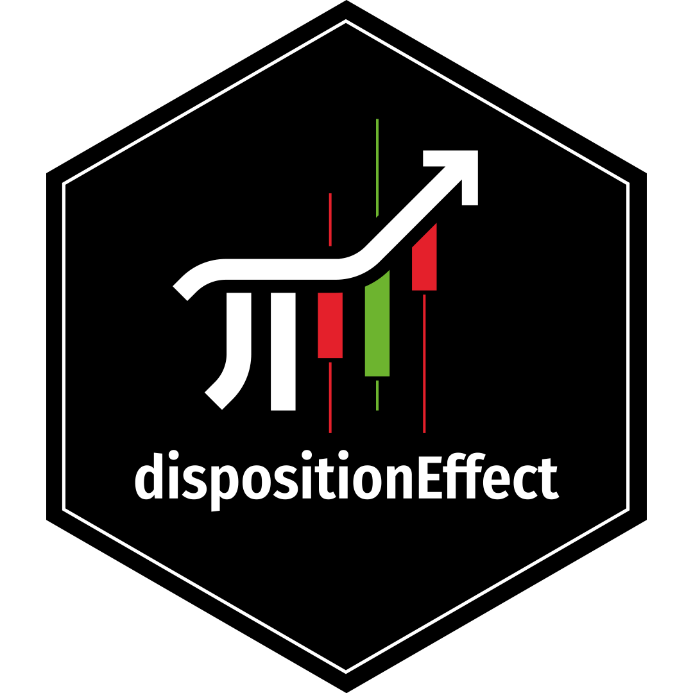

<!-- README.md is generated from README.Rmd. Please edit that file -->

```{r, include = FALSE}
knitr::opts_chunk$set(
	message = FALSE, 
  warning = FALSE,
  collapse = TRUE,
  comment = "#>",
  fig.path = "man/figures/README-",
  out.width = "100%"
)
options(tibble.print_min = 5, tibble.print_max = 5)
options(scipen = 1, digits = 2)
```
  
  
# dispositionEffect 

<!-- badges: start -->

[](https://github.com/marcozanotti/dispositionEffect/actions)
[](https://codecov.io/gh/marcozanotti/dispositionEffect?branch=master)
[](https://lifecycle.r-lib.org/articles/stages.html#experimental)
[](https://CRAN.R-project.org/package=dispositionEffect)
<!-- badges: end -->

The `dispositionEffect` package allows to quickly evaluate the presence
of disposition effect's behaviours of an investor based solely on his
transactions and the market prices of the traded assets.
  
  
## Installation

By the moment, you can only install the development version from
[GitHub](https://github.com/) with:

```{r, eval = FALSE}
install.packages("devtools")
devtools::install_github("marcozanotti/dispositionEffect")
```

You will be able to install the released version of `dispositionEffect`
from [CRAN](https://CRAN.R-project.org) with:

```{r, eval = FALSE}
install.packages("dispositionEffect")
```
  
  
## Overview

The package contains few user-friendly purpose specific interfaces:

* `portfolio_compute` is a wrapper function that compute realized and
paper gains and losses from the investor's transactions and the market
prices of the traded assets and updates the investor's portfolio    

* `gains_losses` is the core function of the package. It performs all
the necessary calculations and can be used for real-time processing
(it is intended for advanced users only)  
  
* `disposition_effect` computes the disposition effect  

* `disposition_difference` computes the disposition difference  

* `disposition_compute` interfaces that allows to easily apply the two 
previous functions to results obtained from `portfolio_compute`  

* `disposition_summary` interfaces that allows to easily compute summary
statistics of disposition effect from the results obtained with 
`portfolio_compute`  

* `disposition_compute_ts` time series version of `disposition_compute` to
obtain the time series of disposition effect  

* `disposition_summary_ts` time series version of `disposition_summary_ts` 
to compute summary statistics on time series disposition effect  
  
  
## Tutorials

* Getting started  
  
* The Analysis of Disposition Effect  

* Disposition Effect in Parallel  

* Time Series Disposition Effect  
  
  
## Getting started

The following simple example shows how to perform disposition effect 
calculations on real financial market data.  

```{r, eval = TRUE}
library(dispositionEffect)
```

Portfolio of transactions of a real investor.

```{r, eval = TRUE}
head(investor)
```

Dataset of market prices of the traded assets.

```{r, eval = TRUE}
head(marketprices)
```

Compute realized gains, realized losses, paper gains and paper losses.

```{r, eval = TRUE}
portfolio_results <- portfolio_compute(
	portfolio_transactions = investor, 
	market_prices = marketprices
)
```

Compute the disposition effect with different methods.

```{r, eval = TRUE}
de <- disposition_compute(portfolio_results)
de
```

Summarise the behaviour of the investor.

```{r, eval = TRUE}
disposition_summary(portfolio_results)
```

Plot the results to spot the presence of the disposition effect.

```{r, eval = TRUE}
library(ggplot2)
ggplot(de, aes(x = asset, y = DE_count, fill = asset)) +
	geom_col() +
	scale_fill_viridis_d() +
	labs(
		title = "Disposition Effect results for the traded assets.",
		subtitle = "Method Count",
		x = "", y = ""
		)
```

Since financial data may be potentially huge in size, efficiency
concerns are solved through the parallel versions of the main
functions.

```{r, eval = FALSE}
portfolio_results_parallel <- portfolio_compute_parallel(
	portfolio_transactions = investors, 
	market_prices = marketprices, 
	allow_short = TRUE
)
```
  
  
## Getting help

If you encounter a clear bug, please file an issue with a minimal
reproducible example on
[GitHub](https://github.com/marcozanotti/dispositionEffect/issues).

For questions and other discussion, mail us at
[zanottimarco17\@gmail.com](mailto:zanottimarco17@gmail.com).
  
  
## Acknowledgements

A special thank to [Claud
Graphics](https://www.behance.net/claudiocec3c4f) for our logo.
  
  
------------------------------------------------------------------------

Please note that this package is free and open source software, licensed
under MIT.
