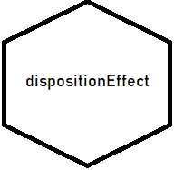
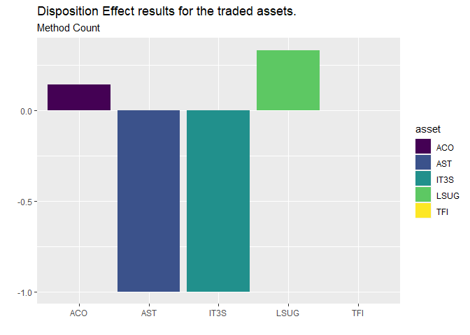

<!-- README.md is generated from README.Rmd. Please edit that file -->

# dispositionEffect 

<!-- badges: start -->

[](https://github.com/marcozanotti/dispositionEffect/actions)
[](https://codecov.io/gh/marcozanotti/dispositionEffect?branch=master)
[](https://lifecycle.r-lib.org/articles/stages.html#experimental)
[](https://CRAN.R-project.org/package=dispositionEffect)
<!-- badges: end -->

The `dispositionEffect` package allows to quickly evaluate the presence
of disposition effect’s behaviours of an investor based solely on his
transactions and the market prices of the traded assets.

## Installation

By the moment, you can only install the development version from
[GitHub](https://github.com/) with:

``` r
install.packages("devtools")
devtools::install_github("marcozanotti/dispositionEffect")
```

You will be able to install the released version of `dispositionEffect`
from [CRAN](https://CRAN.R-project.org) with:

``` r
install.packages("dispositionEffect")
```

## Overview

The package contains few user-friendly purpose specific interfaces:

-   `portfolio_compute` is a wrapper function that compute realized and
    paper gains and losses from the investor’s transactions and the
    market prices of the traded assets and updates the investor’s
    portfolio

-   `gains_losses` is the core function of the package. It performs all
    the necessary calculations and can be used for real-time processing
    (it is intended for advanced users only)

-   `disposition_effect` computes the disposition effect

-   `disposition_difference` computes the disposition difference

-   `disposition_compute` interfaces that allows to easily apply the two
    previous functions to results obtained from `portfolio_compute`

-   `disposition_summary` interfaces that allows to easily compute
    summary statistics of disposition effect from the results obtained
    with `portfolio_compute`

-   `disposition_compute_ts` time series version of
    `disposition_compute` to obtain the time series of disposition
    effect

-   `disposition_summary_ts` time series version of
    `disposition_summary_ts` to compute summary statistics on time
    series disposition effect

## Tutorials

-   Getting started

-   The Analysis of Disposition Effect

-   Disposition Effect in Parallel

-   Time Series Disposition Effect

## Getting started

The following simple example shows how to perform disposition effect
calculations on real financial market data.

``` r
library(dispositionEffect)
```

Portfolio of transactions of a real investor.

``` r
head(investor)
#>   investor type asset quantity price            datetime
#> 1    ID123    B   ACO       45   3.9 2018-04-09 11:17:30
#> 2    ID123    B  LSUG      450   2.1 2018-05-17 15:06:53
#> 3    ID123    S   ACO       45   4.2 2018-05-22 17:11:09
#> 4    ID123    B  IT3S      230   1.1 2018-05-28 14:30:46
#> 5    ID123    S  IT3S      230   1.0 2018-06-01 15:27:02
#> 6    ID123    B  LSUG       90   2.5 2018-06-01 15:43:51
```

Dataset of market prices of the traded assets.

``` r
head(marketprices)
#>   asset            datetime price
#> 1   ACO 2018-04-09 11:17:30  3.94
#> 2   AST 2018-04-09 11:17:30  2.20
#> 3  IT3S 2018-04-09 11:17:30  1.02
#> 4  LSUG 2018-04-09 11:17:30  2.25
#> 5   TFI 2018-04-09 11:17:30  0.41
#> 6   ACO 2018-05-17 15:06:53  4.56
```

Compute realized gains, realized losses, paper gains and paper losses.

``` r
portfolio_results <- portfolio_compute(
    portfolio_transactions = investor, 
    market_prices = marketprices
)
```

Compute the disposition effect with different methods.

``` r
de <- disposition_compute(portfolio_results)
de
#>   investor asset DE_count DE_total DD_value DD_duration
#> 1    ID123   ACO     0.14    0.041   0.0087         440
#> 2    ID123   AST    -1.00   -1.000  -0.0750        -165
#> 3    ID123  IT3S    -1.00   -1.000  -0.0310         -57
#> 4    ID123  LSUG     0.33    0.355   0.0106        1412
#> 5    ID123   TFI     0.00    0.000   0.0000           0
```

Summarise the behaviour of the investor.

``` r
disposition_summary(portfolio_results)
#> $de
#>   investor asset DE_count DE_total DD_value DD_duration
#> 1    ID123   ACO     0.14    0.041   0.0087         440
#> 2    ID123   AST    -1.00   -1.000  -0.0750        -165
#> 3    ID123  IT3S    -1.00   -1.000  -0.0310         -57
#> 4    ID123  LSUG     0.33    0.355   0.0106        1412
#> 5    ID123   TFI     0.00    0.000   0.0000           0
#> 
#> $stat
#>   investor   stat DE_count DE_total DD_value DD_duration
#> 1    ID123     Q1    -1.00   -1.000  -0.0310         -57
#> 2    ID123 Median     0.00    0.000   0.0000           0
#> 3    ID123     Q3     0.14    0.041   0.0087         440
#> 4    ID123   Mean    -0.30   -0.321  -0.0173         326
#> 5    ID123  StDev     0.65    0.635   0.0363         649
#> 6    ID123    Min    -1.00   -1.000  -0.0750        -165
#> 7    ID123    Max     0.33    0.355   0.0106        1412
```

Plot the results to spot the presence of the disposition effect.

``` r
library(ggplot2)
ggplot(de, aes(x = asset, y = DE_count, fill = asset)) +
    geom_col() +
    scale_fill_viridis_d() +
    labs(
        title = "Disposition Effect results for the traded assets.",
        subtitle = "Method Count",
        x = "", y = ""
        )
```



Since financial data may be potentially huge in size, efficiency
concerns are solved through the parallel versions of the main functions.

``` r
portfolio_results_parallel <- portfolio_compute_parallel(
    portfolio_transactions = investors, 
    market_prices = marketprices, 
    allow_short = TRUE
)
```

## Getting help

If you encounter a clear bug, please file an issue with a minimal
reproducible example on
[GitHub](https://github.com/marcozanotti/dispositionEffect/issues).

For questions and other discussion, mail us at
<zanottimarco17@gmail.com>.

## Acknowledgements

A special thank to [Claud
Graphics](https://www.behance.net/claudiocec3c4f) for our logo.

------------------------------------------------------------------------

Please note that this package is free and open source software, licensed
under MIT.
