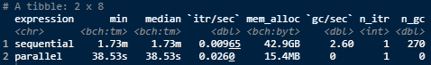
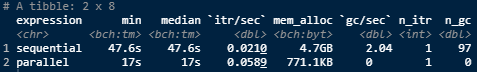

```{r, include = FALSE}
knitr::opts_chunk$set(
  message = FALSE, 
  warning = FALSE,
  collapse = TRUE,
  comment = "#>",
  out.width = "100%"
)
```
  
&nbsp;   

# Package loading

To load the  package simply use the usual `library` function.  
This tutorial requires also some well-known packages that allows
for parallel computations in R.

```{r, eval = TRUE}
library(dispositionEffect)
library(dplyr)
library(foreach)
library(parallel)
library(doParallel)
library(future)
library(furrr)
library(bench)
```
  
&nbsp;   

# Data

The disposition effect analysis is performed on two fundamental types
of data frames:

* portfolio transactions, that is all the financial transactions an
investor did during a specific period of time. 
A single transaction is made up of 6 features: the investor id, 
the asset id, the type of the transaction (it can be a buy or a sell), 
the traded quantity, the traded price, and the datetime.

* market prices, that is the prices found on the stock markets for 
each traded asset and each transaction datetimes.  
  
&nbsp;     

# The Problem

Usually, investor's transactions datasets may be huge in size. 
Moreover, the dataset of market prices may grow exponentially
since it has to contain the market prices for each traded asset
on each trading datetime. 

This may cause the computation of gains and losses through the
main interface of the package (`portfolio_compute`) to take few
minutes in order to produce the output data frame.  

This computational inefficiency is particularly due to the size
of the market price dataset, since for every transaction we need
to look for the closest available market price at that datetime
for each asset. 

For this reason, we used few parallel methodologies to improve
the computation time on large datasets.
  
&nbsp;     

# The Solution: Parallel Computing

## 1) Parallel `porfolio_compute`

Usually, you may want to apply the computations on many different
investors. To do that one can simply build a function that loops
on a list containing the transactions portfolios. The first solution 
to this problem is to develop a parallel version of 
`portfolio_compute` that allows to compute results on many
investors in parallel, taking advantage of two very useful 
R packages: `future` and `furrr`.

A very simple version of the function would look like this.  

```{r, eval=TRUE}
portfolio_compute_parallel <- function(portfolio_transactions, market_prices, plan = NULL, ...) {

	investors_id <- purrr::map_chr(portfolio_transactions, ~purrr::pluck(., "investor")[1])
	portfolio_compute_safe <- purrr::safely(portfolio_compute)

	if (is.null(plan)) {
	  ncores <- future::availableCores()
	  # if there are more than 2 cores than use parallel computing
	  # otherwise use sequential computing
	  # RULE: be polite, always leave at least 1 free core
	  if ((ncores - 1) > 1) {
		  new_plan <- "multisession" # since I am testing on Windows
	  } else {
		  new_plan <- "sequential"
	  }
	} else {
	  new_plan <- plan
	}
	
	old_plan <- future::plan(strategy = new_plan)

	res <- furrr::future_map(
		portfolio_transactions,
		portfolio_compute_safe,
		market_prices,
		...)

	res <- purrr::transpose(res)$result
	names(res) <- investors_id

	future::plan(old_plan) # set back the old plan

	return(res)

}
```

This way you simply need to store all the different investor's 
portfolios of transactions in a list and pass it to 
`portfolio_compute_parallel` as first argument.  

Now let's try it on the `DEanalysis` dataset to see if there is
any computational improvement.

```{r, eval=TRUE}
trx <- DEanalysis$transactions %>% 
  dplyr::group_by(investor) %>% 
  dplyr::group_split()
mkt <- DEanalysis$marketprices
```

```{r, eval=FALSE}
res <- bench::mark(
  "sequential" = portfolio_compute_parallel(trx, mkt, plan = "sequential"),
  "parallel" = portfolio_compute_parallel(trx, mkt, plan = "multisession")
)

res$expression <- c("sequential", "parallel")
res[, 1:8]
```

```{r, echo=FALSE, fig.align='center'}

```

As you can see, the benefits of parallel code are clear even on this
small sample dataset.  

&nbsp;     

## 2) Separate files

Although the first solution may be enough with many small
investors, when things get bigger it may be better to physically
separate transactions and market prices for each investor.

This way, a single `.RData` that contains both the transactions and
the market prices for a single investor is created. 
Once this process is finished, one can simply perform the computations
with the usual `portfolio_compute` loading the needed file sequentially
or in parallel by means of the `foreach`package.

First let's store every investor's datasets into its own file. To do this
we can make use of the `dispositionEffect:::generate_data` internal function.
In this way, we are able also to optimize the market price dataset, since
for each investor we can save only the market prices of his traded assets 
for that specific period of trading.  

```{r, eval=FALSE}
cl <- parallel::makeCluster(parallel::detectCores())
doParallel::registerDoParallel(cl)
foreach::foreach(i = seq_along(trx), .errorhandling = "pass") %dopar% {

  transactions <- dplyr::arrange(trx[[i]], datetime)
  mrkt_prices <- dplyr::filter(
    mkt, 
    asset %in% unique(transactions$asset) & 
      datetime <= max(transactions$datetime)
  )
  df <- dispositionEffect:::generate_data(transactions, mrkt_prices, subset = TRUE)
  nm <- paste0("INV", i, ".RData")
  save(df, file = nm)

}
parallel::stopCluster(cl)
```

Now, we can build the function to perform computations
loading each single file sequentially or in parallel.

```{r, eval=FALSE}
portfolio_compute_onfiles <- function(files, plan = "sequential") {
  
  if (plan == "sequential") {
    
    res_list <- vector(mode = "list", length = length(files))
    for (i in seq_along(files)) {
      load(files[i]) # load the file
      tmp_res <- tryCatch(
        dispositionEffect::portfolio_compute(
          portfolio_transactions = df$transactions,
          market_prices = df$marketprices
        ),
        error = function(e) "Error"
      )
      res_list[[i]] <- tmp_res # save results
      rm(df, tmp_res)
    }
    
  } else {
    
    cl <- parallel::makeCluster(parallel::detectCores())
    doParallel::registerDoParallel(cl)
    res_list <-
      foreach(i = seq_along(files), .errorhandling = "pass") %dopar% {
        load(files[i]) # load the file
        tmp_res <- tryCatch(
          dispositionEffect::portfolio_compute(
            portfolio_transactions = df$transactions,
            market_prices = df$marketprices
          ),
          error = function(e) "Error"
        )
      }
    parallel::stopCluster(cl)
    
  }

  return(res_list)
    
}
```

```{r, eval=FALSE}
files <- list.files(pattern = ".RData") # list all single .RData

res <- bench::mark(
  portfolio_compute_onfiles(files, plan = "sequential"),
  portfolio_compute_onfiles(files, plan = "multisession")
)

res$expression <- c("sequential", "parallel")
res[, 1:8]
```

```{r, echo=FALSE, fig.align='center'}

```

&nbsp;     

# Conclusions

As expected, parallel computation coupled with load in memory 
small portion of datasets is the optimal solution.  

Moreover, sometimes a little gain in computation time can be
obtained by setting the `exact_market_prices` argument of 
`portfolio_compute` equal to TRUE. This way, the closest
market price search is performed on the very same transaction
datetime, but it requires that the market price dataset contains
all the prices for each asset at each single transaction datetime.

&nbsp;  
  
&nbsp;  

---------------------------------------------------------------------------

*This tests have been performed on a 4 core, 8GB RAM, Windows machine*
```{r, eval=TRUE, echo=FALSE}
# system('systeminfo')
version
```

&nbsp;  

For more tutorials on disposition effect visit 
[dispositionEffect](https://marcozanotti.github.io/dispositionEffect/).


